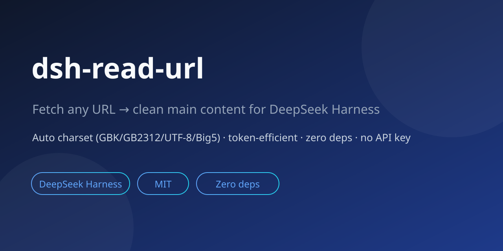

# dsh-read-url



URL reader plugin for DeepSeek Harness: fetch any webpage, **auto-detect encoding (GBK/GB2312/UTF-8/Big5)**, extract the clean main content, and return **token-efficient compact text or structured Markdown**.

Zero dependencies (Node 20+ built-ins), no API key, no server side — install and use.

## Why

DSH agents can search (getting links and snippets) but lack the step of "reading a URL into clean body text". The official `tool-web` `web_fetch` does a **whole-page turndown conversion** (nav/ads/sidebars all preserved) with a default cap of 200,000 characters — a token black hole. This plugin returns only what the model actually needs: **cleaned body + essential metadata**, truncated by default.

### Competitor comparison (measured from source/docs, 2026-08-15)

| Capability | Official `tool-web` web_fetch | dsh-webfetch | dsh-scrape-webpage | **dsh-read-url** |
|---|---|---|---|---|
| Body cleaning (container-level) | ❌ whole page | ⚠️ tag-level, nav/footer leak in | ⚠️ custom, noisy | ✅ article/main containers + noise stripping |
| Default output cap | 200,000 chars | 50,000 chars | 30,000 chars | **6,000 chars + paragraph-aligned truncation** |
| Chinese GBK/GB2312 | provider-dependent | ⚠️ not normalized, GB2312 garbles | ❌ not handled | ✅ normalized + mojibake fallback |
| Session-level cache | ❌ | ❌ | ❌ | ✅ 5-min TTL |
| `ctx.web` seam | ✅ (official core) | ❌ global fetch | ❌ | ✅ seam-first, fallback included |
| `ctx.effect` unload cleanup | ✅ | ❌ | ❌ | ✅ |
| Cooperative timeout (hidden from model) | ✅ | ⚠️ self-managed | ⚠️ self-managed | ✅ `timeoutMs` + `exec.signal` |
| Model-facing output | whole-page Markdown | compact text | 15-field JSON | **compact text (no JSON parsing)** |
| Dependencies | official | TypeScript build | zero deps | zero deps (JS ESM, drop-in) |
| Anti-bot / degraded responses (UA & TLS fingerprint) | ⚠️ Node default UA; measured: https intercepted by middlebox TLS fingerprinting, Baidu returns a degraded page without trending topics | ❓ not disclosed | ❓ not disclosed | ✅ full browser UA; measured: full page fetched (Baidu trending topics intact) |

> Measured 2026-08-16 (local environment): with this plugin removed, the official `web_fetch` hitting `https://www.baidu.com` had its TLS handshake intercepted by a middlebox using program fingerprints (fell back to http to succeed), and Baidu returned a **server-side degraded page** (trending topics moved to JS loading, absent from static HTML). With `dsh-read-url` restored, https worked and trending topics were fully readable. Root cause: the request's UA and TLS characteristics decide whether sites/middleboxes treat you as a bot.

## DSH architecture compliance

Implemented per official docs (`docs/capability-seams.md`, `docs/cordis-primer.md`, `docs/tool-execution-pipeline.md`):

1. **Web access via the `ctx.web` capability seam** — all web requests go through `ctx.web.fetch()` first (provider resolved inside the seam, same as official `tool-web`), falling back to global fetch when the seam is absent. The network layer is replaceable, not bound to any provider;
2. **Reversible side effects** — the session cache is registered under `ctx.effect`, auto-cleared on plugin unload (temporal composability);
3. **Cooperative tool-call timeout** — `ToolDefinition.timeoutMs` declares the budget, `execute(args, exec)` forwards `exec.signal` to fetch; the timeout policy is enforced by the pipeline, never exposed to the model;
4. **Model-facing simplicity** — render emits compact text (`title:` header + body); the model consumes it directly with no JSON parsing. Defaults are the most token-efficient; structured output is opt-in.

## Install

```bash
# From GitHub (recommended, easy updates)
npx @deepseek-ai/dsh plugin --profile web add github:2672243194/dsh-read-url

# Local development
npx @deepseek-ai/dsh plugin --profile web add ./dsh-read-url
```

Restart DSH (Web/TUI); you should see `dsh-read-url` enabled in Settings → Plugins.

## Usage

Just talk to the agent:

```
Read https://example.com/article and summarize the key points
Read https://docs.example.org/guide in markdown mode
```

### Tools

**`read_url(url, maxChars?, offset?, mode?, includeLinks?)`** — fetch and extract clean body

| Param | Type | Default | Description |
|---|---|---|---|
| `url` | string | required | http(s) URL |
| `maxChars` | number | 6000 | Max body characters returned (500–20000) |
| `offset` | number | 0 | Resume reading from this character offset (long-article continuation; served from cache without repeating earlier text) |
| `mode` | string | `text` | `text` = plain (most token-efficient); `markdown` = structured |
| `includeLinks` | boolean | `false` | Also return up to 20 page links (title+URL) |

**`read_url_batch(urls, maxChars?, mode?, includeLinks?)`** — read multiple URLs (1–10) in parallel, each cleaned individually, merged into one compact report

| Param | Type | Default | Description |
|---|---|---|---|
| `urls` | string[] | required | http(s) URL list (1–10) |
| `maxChars` | number | 3000 | Max body characters per page (500–20000) |
| `mode` | string | `text` | `text` = plain; `markdown` = structured |
| `includeLinks` | boolean | `false` | Also return links per page (title+URL) |

- Concurrency capped at 4 (avoids rate-limiting); a failing page is **isolated** (`[失败]` + reason in the output) and does not affect the others;
- Reuses every `read_url` capability and the session cache (encoding, cleaning, SPA rendering, 5-min cache — repeat batches hit the cache).

**`read_url_links(url, limit?)`** — list the page's links without returning body text (lighter; good for sourcing / mapping a site)

| Param | Type | Default | Description |
|---|---|---|---|
| `url` | string | required | http(s) URL |
| `limit` | number | 20 | Max links returned (1–50) |

### Configuration (optional)

Plugin-level config is overridable via the profile's `cordis.patch.yml` (defaults in the plugin's own `cordis.patch.yml`):

```yaml
- id: dsh-read-url
  config:
    timeoutMs: 15000      # per-request timeout
    maxBytes: 3145728     # response body cap (bytes)
    maxChars: 6000        # default body truncation
    maxLinks: 20          # read_url_links default count
    spaRender: true       # SPA rendering enhancement (needs playwright installed; degrades with a hint otherwise)
    userAgent: '...'      # request UA
```

### Output (compact)

```json
{
  "url": "...",
  "title": "...",
  "siteName": "...",
  "lang": "zh-CN",
  "charset": "gbk",
  "mode": "text",
  "truncated": true,
  "charsTotal": 12990,
  "charsReturned": 6000,
  "text": "...",
  "links": []          // only when includeLinks=true
}
```

### PTC mode

Output is pure JSON and composable; orchestrate parallel multi-URL reads in PTC mode:

```ts
const results = await Promise.all([
  read_url({ url: 'https://a.example.com', maxChars: 4000 }),
  read_url({ url: 'https://b.example.com', maxChars: 4000 }),
])
```

## Token economy (core)

1. **Body text only by default** — no redundant headings/keywords/images/word-count fields; take them via params only when needed;
2. **Paragraph-aligned truncation + offset continuation** — 6,000 chars by default (~3,000 tokens), cut at paragraph boundaries to keep semantics; output notes `chars 6000/12990` and guides continuation via `offset`; resume starts at the given offset, sliced from cache — **no repetition of already-read text** (measured 0+500 → 500+500, no overlap);
3. **`text` mode first** — Markdown structure is opt-in;
4. **Compact text render** — the model sees a `title:` header + body directly, no JSON parsing; `siteName` is omitted when identical to the hostname, zero metadata redundancy;
5. **Session cache** — repeated reads of the same URL within 5 minutes hit cache: fewer network calls and fewer model retries;
6. **KV-cache friendly (DeepSeek cost tuning)** — tool schema/description stay **static text** (no config values embedded), so changing config never invalidates the reusable prompt prefix and KV cache keeps hitting. DeepSeek's cache-hit tokens cost about 1/10 of misses — the more stable the prefix, the cheaper the run (same analysis as the official `tool-web` docs).

## Technical notes

- **Encoding**: three-level detection (HTTP `Content-Type` charset → HTML meta → BOM), built-in `TextDecoder` transcoding (Node 20+ full-icu), GB2312 normalized to GBK, auto-fallback to UTF-8 on mojibake;
- **Extraction**: prefers `<article>` / `role="main"`, strips `nav/footer/header/aside/form/iframe` and ad-like containers, heuristic fallback to `<body>`;
- **Markdown**: self-written lightweight tag state machine (headings/paragraphs/lists/blockquotes/code/tables/inline bold-italic-links), zero deps;
- **Safety**: http/https only; no page scripts executed; responses over 3 MB rejected; 15s timeout; structured errors (HTTP status / timeout / unsupported type);
- **Optional enhancement 1 (Firefox Reader Mode algorithm)**: run `npm i @mozilla/readability happy-dom` in the DSH profile directory to auto-enable `@mozilla/readability` (MPL-2.0, referenced unmodified) for higher-quality extraction; falls back to the built-in heuristic when not installed — the core stays zero-dependency;
- **Optional enhancement 2 (SPA page rendering)**: run `npm i playwright && npx playwright install chromium` in the DSH profile directory to auto-enable it. When the extracted body is empty and the page is script-heavy (likely Vue/React client-rendered), the plugin automatically renders it with headless Chromium before extracting (a `rendered` flag tells the model); when not installed it degrades with a clear install hint, never errors — the core stays zero-dependency;
- **Boundaries**: login-walled pages can't be read; SPA pages need the Playwright enhancement to be rendered (a clear hint is returned when it isn't installed).

## Roadmap

- [x] Single-page continuation (`offset` parameter)
- [x] On-demand SPA rendering (optional Playwright enhancement, auto-enabled once the browser is installed)

## Development

```bash
node test.mjs          # zero-dependency self-tests (charset/extract/markdown/truncate)

# End-to-end (requires DSH CLI)
npx @deepseek-ai/dsh plugin --profile headless add .        # run from the parent dir of the plugin
npx @deepseek-ai/dsh --profile headless "use read_url to read https://example.com and output the title"
```

Verified against real DSH v0.1.0-rc.6: plugin loads, `read_url` registers, model calls it, real page content returned.

## Support

If dsh-read-url helps you, please give it a ⭐ Star on [GitHub](https://github.com/2672243194/dsh-read-url).

- Completely free and open source (MIT): zero dependencies, no API key, fully local processing, no data collection;
- Independently developed and maintained — your Star is the direct signal for whether I keep investing in it;
- More users means more features — the next one might be exactly what you need.

A Star costs nothing but helps this project go further. Thanks ⭐

## License

MIT
